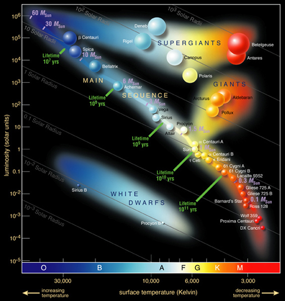

# Week 7

---
*Wednesday Only*

## TRAPPIST-1 Exoplanet Detection

- Ultra-cool red dwarf star.
- When the planets pass in from of the star, it becomes fainter. 
- Analyzing the changes in light data lets us determine their characteristics.

## Apparent Brightness
- The **apparent brightness** of a star depends on both distance and **luminosity**.
- The **luminosity** of a star is the "true brightness" of the star, regardless of distance. It is measured in *lumens* ($L$)

### Relationship between Luminosity, Size, and Temperature
$$
L \propto R^2 \cdot T^4
$$
Where $L$ is the luminosity of the star in lumens, $R$ is the radius of the star in meters, and $T$ is the surface temperature of the star in *Kelvin*.

## HR Diagram
- The HR Diagram is a scatter plot that relates a star's *luminosity* to it's *surface temperature* (or color) and classify them. 
- The class of a star is dependent only upon the star's temperature. 
- Within a star class, the *luminosity* of the star tells us how massive the star is. 
    - An M class star with higher *luminosity* will be more *massive* than an M class star with a lower *luminosity*.

