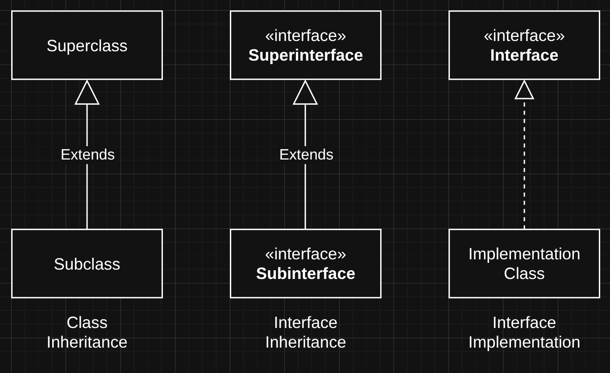
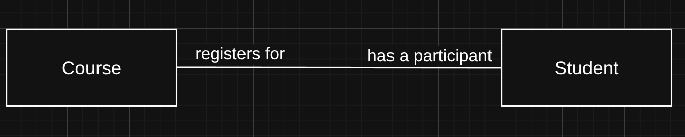
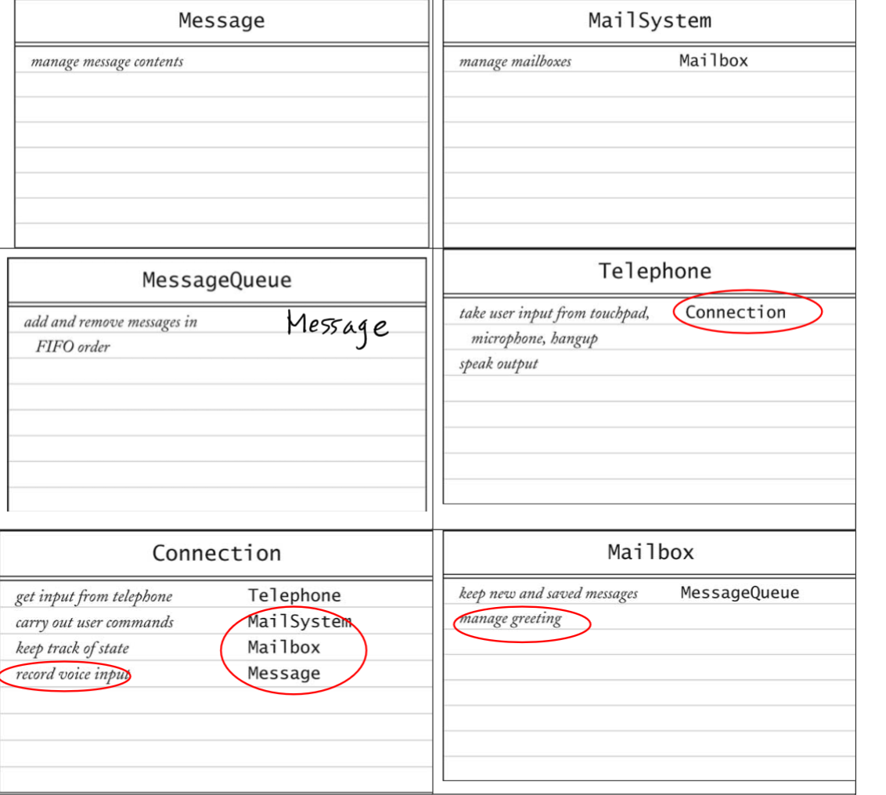
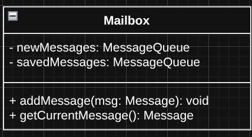
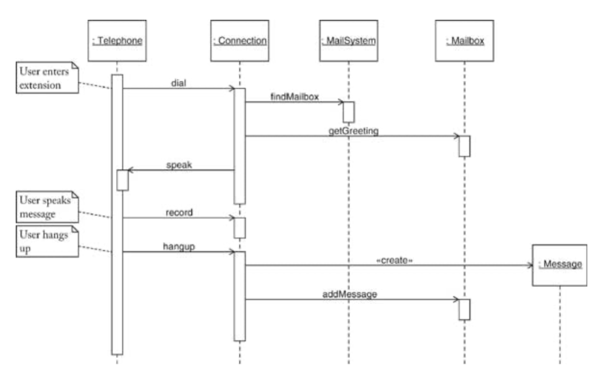
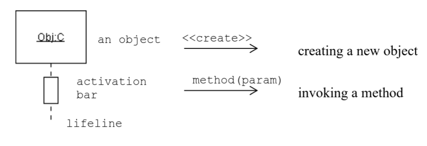
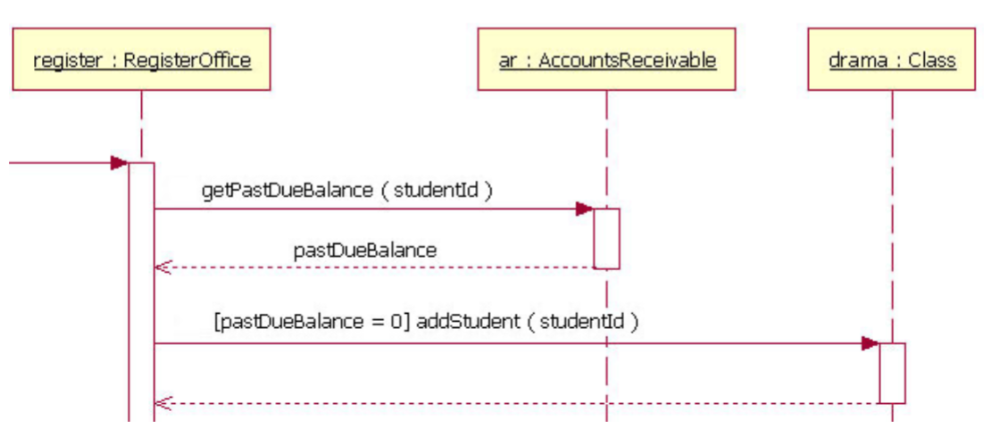
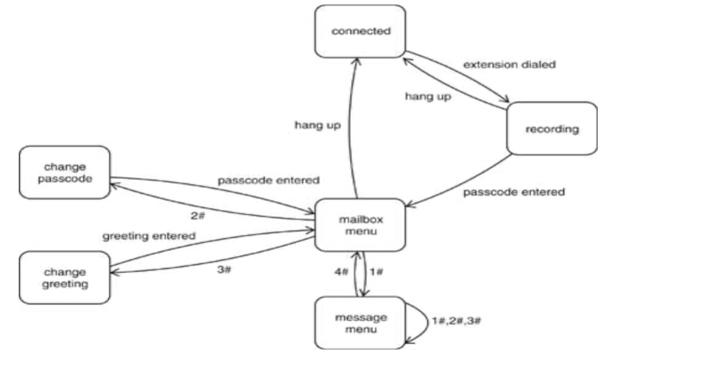

# Chapter 2 - Design Phase

---

## Overview
- Requirement Analysis
- O.O. Design
- Implementation
- Inputs and outputs of above stages

## Requirement Analysis
- Input: **Client Request**
    - Often non-technical people making request
- Output: **Requirement Spec.**
    - A technical document with agreed upon functional and non-functional requirements

### Two categories of requirement:
#### Functional Requirements
- concerned with functions and services to be carried out by the software
- Examining **use cases** will populate functional requirements
- i.e. Calander app must be able to add, remove, and edit events
#### Non-Functional Requirements
- concerned with the constraints under which the software must operate, such as response time and memory consumption
- i.e. Calandar app must run on a S.O.C. with 2 kb of RAM

### Use Cases
- Examines the interactions between user and system
- This informs designers which functional requirements are needed
- Variations and edge cases should be explored to create a complete use case

#### Example: Leave a Message
##### Original Case
- User: Dials phone number
- System: The voice mail system plays a prompt
- User: The caller types in the extension of the person they are trying to reach
- System: Speaks "you have reached the voice mailbox of xxxx..."
- User: Leaves a message
- User: Hangs up
- System: Saves recorded message to file system

##### Variation
- User: Dials
- System: Plays prompt
- User: hangs up
- System: Does not save message data

## Object Oriented Design Phase
- Goal: To identify classes/interfaces, their responsibilites, and relationships

### Tools:
#### Noun/Verb analysis
- Goal: To form an inital set of classes and responsibility
- **Nouns** are people, places, and things we need to write classes for
    - i.e. Mailbox, Event, Message
- **Verbs** are actions that need to be performed, which inform class responsibilities. Usually the member functions of a class
    - i.e. Save, Delete, Edit

##### Noun Analysis
- User and Role
    - Used to establish different users with different roles and permissions of a system
- Systems
    - Model a subsystem or the overall system being built
    - Used to initiate and terminate the system
- System interfaces and devices
    - These capture system resources and the interaction of the system
    - Display window, input reader, output file, etc
    - i.e. ```File``` class
- Foundational Classes
    - These are typically generic fundamental classes
    - At the beginning we should assume they exist

##### Responsibility/Verb Analysis
- A responsibility must belong to exactly one class
- A responsibility of a class should stay at one abstraction level

#### CRC
- Goal: Refine classes and responsibilities and define relationships
- Stands for Classes, Responsibilities, and Collaboration

### Identity vs State
- An objects **identity** comes from it's memory address
- An objects **state** comes from the content of it's member variables

#### Object Comparison
- ```==``` compares by memory address (are 2 variables pointing to the same obj)
- ```.equals()``` compares by content, or the member variables of the object

### Other Common Object Types
#### Agent Classes 
- Encapsulate commonly used operations within an application
- i.e. a class with all file IO operations

#### Events
- Holds all information related to a particular event in a system
- i.e. onMouseClick, onKeyPress

### Relationships
#### Is-a
- Class 1 *is a* Class 2
- **Inheritance** literally means the child object *is a* parent object, and can be cast as such
- **Interface** means the object impliments an interface, meaning it can do the things other classes that impliment the same interface can do
    - Remember that interfaces can extend from other interfaces
- *Implimentation Specific*
- UML Syntax:


#### Has-a
- **Aggregation** is a weaker form of composition
- **Composition** literally means Object1 *has a* member variable of type Object2
- For our purposes, we will treat aggregation and composition the same
- Always an instance variable
    - Non user-defined instance variables are called attributes, and do not have a has-a relationship with the class
- UML Syntax:


#### Uses
- Object1 *uses* Object2
- Also called **Dependency**
- A temporary relationship where Object1 needs Object2 to perform a task
    - Return typs
    - Method parameters
- UML Syntax:

##### Optimized Version of Above Example
- Avoids parameter passing overhead


#### Association
- Object1 *associates with* Object2
- A more permanent relationship than dependency, but not as strong as composition
- Bidirectional unless otherwise specified by arrows
- UML Syntax:

- If unidirectional, use arrows to indicate direction of association


### Use Case Study
- Use cases should be initiated by an actor (user or external system)
- Identify variations and edge cases
#### Use Case: Reach an Extension
| Step | User Action | System Response |
|-------|--------------|------------------|
| 1 | Dials phone number | |
| 2 | | The voice mail system plays a prompt |
| 3 | Types in extension of person trying to reach | |
| 4 | | Speaks "you have reached the voice mailbox of xxxx..." |

#### Use Case: Leave a Message
| Step | User Action | System Response |
|-------|--------------|------------------|
|1 | Carries out **Reach an Extension** | |
|2 | Leaves a message | |
|3| Hangs up | |
|4| | Saves recorded message to file system |

#### Use Case: Log In
| Step | User Action | System Response |
|-------|--------------|------------------|
|1 | Mailbox owner carries out **Reach an Extension** | |
|2 | Enters password | |
|3 | | Verifies password |
|4 | | Grants access to mailbox functions |

#### Use Case: Retrieve Messages
| Step | User Action | System Response |
|-------|--------------|------------------|
|1 | Mailbox owner carries out **Log In** | |
|2 | Requests to retrieve messages | |
|3 | | System plays back menu options |
|4 | Requests to hear current messages | |
|5 | | System plays back current messages |

---

## CRC Cards
- Class Responsibility Collaboration Cards
- A brainstorming tool to help design object oriented systems
- Maps responsibilities to classes and defines collaborations between classes


---

## UML Diagrams
- Unified Modeling Language
- A standardized way to visualize system design
- Different types of diagrams for different purposes
### Class Diagrams
- Static relationships between classes and interfaces (is-a, has-a, uses, associates)
- Focus on static structure of system
- Example:


### Sequence Diagrams
- Dynamic interactions between objects over time
- Focus on how objects interact to carry out a use case
- Usually one sequence diagram per use case
- Example:


#### Notation
- Objects
    - A rectangle with the name of the object underlined.
    - Objects are listed across the top of the sequence diagram unless they are created
during the time period represented by the sequence diagram.
    - If an object is created, it is shown lower in the diagram. Example: Message
- Life Lines
    - A dashed line that begins when the object is created and ends when the object is destroyed.
- Activation Bars
    - The thin long rectangles along the life line. When a method is invoked, the
activation bar starts, and when the method returns, it ends.
    - Usually the size of the activation bar corresponds to the duration of the method
- Messages
    - Messages are indicated by a horizontal arrow from the sending object to the
receiving object. The method name is shown above the arrow. The parameters are
optional.
- Use of Notes
    - Free form of text enclosed in a rectangle with the upper right corner folded down.



##### Guards
- Conditions that must be true for a message to be sent
- Shown in square brackets above the message arrow
- Example:


### State Diagrams
- Dynamic behavior of a single object over time
- Focus on the different states an object can be in and how it transitions between those states
- Example:


--- 

## JavaDoc :vomit:
Javadoc comments are not meant to explain source code, but rather to generate documentation for the various APIs of a class. Source code in this class must include the following types of Javadoc comments:
1. File-level Javadoc - a brief description of the file and its purpose
2. Class-level Javadoc - a description of the class and its responsibilities
3. Method-level Javadoc - a description of the method, its parameters, return value, and any exceptions it may throw. Includes constructors

### Preconditions and Postconditions
- **Preconditions** are conditions that must be true before a method is called
- **Postconditions** are conditions that must be true after a method is called
- Acts as a contract between the method and its callers, ensuring that the method is used correctly and that it behaves as expected
- Used even for simple methods as they provide clarity and help prevent bugs

### Example
```java
/**
 * Assignment 1 Solution
 * 
 * @author Connor Petri
 * @version 1.0 1/28/26
 */

/**
 * BankAccount represents a bank accout with a balance that can be changed through
 * deposits, withdrawls, All accounts maintain a non-negative balance
 */
public class BankAccount {
    private double balance;
    /**
     * Default constructor constructs a BankAccount with a 0 balance
     */
    public BankAccount() {
        balance = 0;
    }

    /**
     * Constructs a BankAccount with the given initial balance
     * Precondition: initialBalance must be non-negative
     * Postcondition: A BankAccount is created with the given initial balance
     * 
     * @param initialBalance the initial balance of the account, must be non-negative
     * @throws IllegalArgumentException if initialBalance is negative
     */
    public BankAccount(double initialBalance) {
        if (initialBalance < 0) {
            throw new IllegalArgumentException("Initial balance must be non-negative");
        }
        balance = initialBalance;
    }

    /**
     * Sets the balance of the account to the given amount
     * Precondition: amount must be non-negative
     * Postcondition: The balance of the account is set to the given amount
     * 
     * @param amount the new balance of the account, must be non-negative
     * @throws IllegalArgumentException if amount is negative
     */
    public void setBalance(double amount) {
        if (amount < 0) {
            throw new IllegalArgumentException("Balance must be non-negative");
        }
        balance = amount;
    }

    /**
     * Withdraws the given amount from the account
     * Precondition: amount must be non-negative and less than or equal to the current balance
     * Postcondition: The balance of the account is decreased by the given amount
     * 
     * @param amount the amount to withdraw, must be non-negative and less than or equal to the current balance
     * @throws IllegalArgumentException if amount is negative or greater than the current balance
     */
    public void withdraw(double amount) {
        if (amount < 0) {
            throw new IllegalArgumentException("Amount must be non-negative");
        }
        if (amount > balance) {
            throw new IllegalArgumentException("Amount must be less than or equal to the current balance");
        }
        balance -= amount;
    }

    /**
     * Returns the current balance of the account
     * Postcondition: The current balance of the account is returned
     * @return the current balance of the account
     */
    public double getBalance() {
        return balance;
    }
}
```